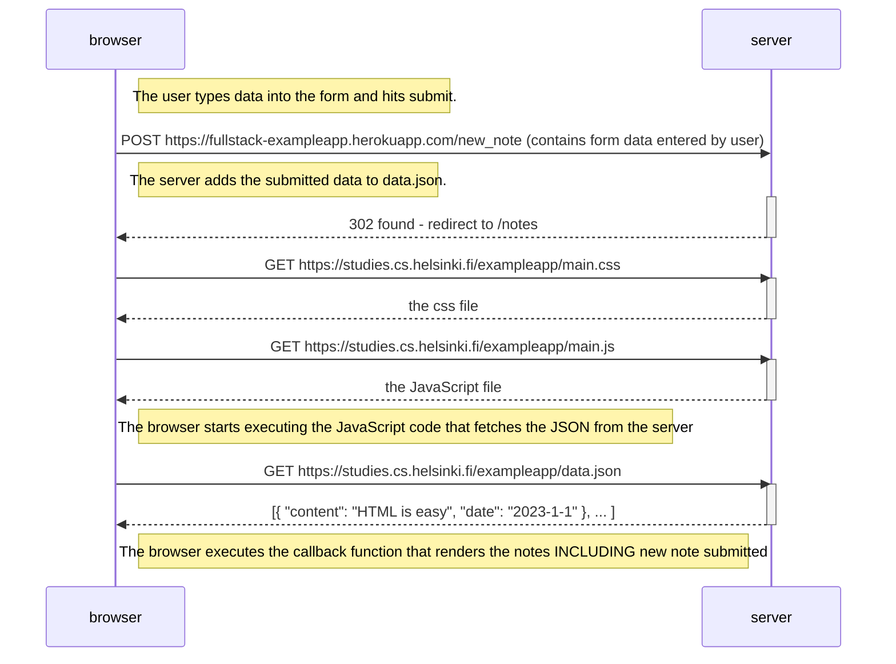
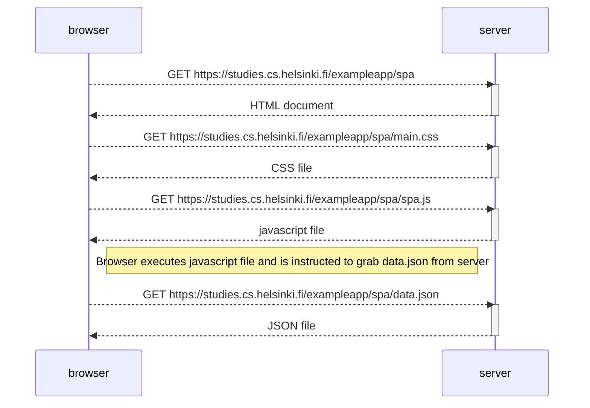
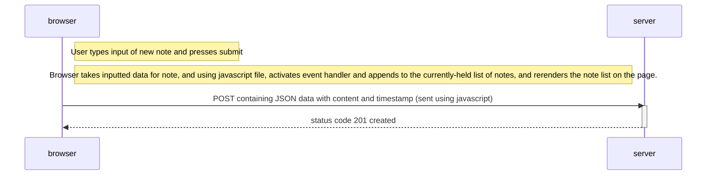

# First exercises

```mermaid
sequenceDiagram
    participant browser
    participant server

    Note right of browser: The user types data into the form and hits submit.
    browser->>server: POST https://fullstack-exampleapp.herokuapp.com/new_note (contains form data entered by user)
    
    Note right of browser: The server adds the submitted data to data.json.

    activate server
    server-->>browser: 302 found - redirect to /notes
    deactivate server

    browser->>server: GET https://studies.cs.helsinki.fi/exampleapp/main.css
    activate server
    server-->>browser: the css file
    deactivate server

    browser->>server: GET https://studies.cs.helsinki.fi/exampleapp/main.js
    activate server
    server-->>browser: the JavaScript file
    deactivate server

    Note right of browser: The browser starts executing the JavaScript code that fetches the JSON from the server

    browser->>server: GET https://studies.cs.helsinki.fi/exampleapp/data.json
    activate server
    server-->>browser: [{ "content": "HTML is easy", "date": "2023-1-1" }, ... ]
    deactivate server

    Note right of browser: The browser executes the callback function that renders the notes INCLUDING new note submitted


```

```mermaid
sequenceDiagram
    participant browser
    participant server

    browser-->>server: GET https://studies.cs.helsinki.fi/exampleapp/spa
    activate server
    server-->>browser: HTML document
    deactivate server

    browser-->>server: GET https://studies.cs.helsinki.fi/exampleapp/spa/main.css
    activate server
    server-->>browser: CSS file
    deactivate server

    browser-->>server: GET https://studies.cs.helsinki.fi/exampleapp/spa/spa.js
    activate server
    server-->>browser: javascript file
    deactivate server

    Note right of browser: Browser executes javascript file and is instructed to grab data.json from server

    browser-->>server: GET https://studies.cs.helsinki.fi/exampleapp/spa/data.json
    activate server
    server-->>browser: JSON file
    deactivate server


```

```mermaid
sequenceDiagram
    participant browser
    participant server

    Note right of browser: User types input of new note and presses submit

    Note right of browser: Browser takes inputted data for note, and using javascript file, activates event handler and appends to the currently-held list of notes, and rerenders the note list on the page. 

    browser->>server: POST containing JSON data with content and timestamp (sent using javascript)
    activate server
    server-->>browser: status code 201 created
    deactivate server
```
